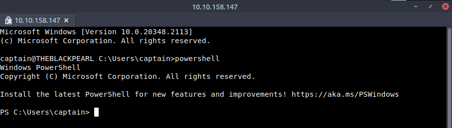

# PowerShell Lab Report (Tasks 3–8)

This lab report documents my hands-on work with PowerShell. Each section demonstrates not only the commands I used but also why I used them, how they can be applied in real-world security or administrative contexts, and what insights they provided. The goal is to showcase practical skills and understanding of how PowerShell can be leveraged effectively.

---

## Task 3: PowerShell Basics

### What I Did
I started by connecting to the target lab machine via SSH and launching PowerShell. Once inside, I explored how PowerShell structures its commands with the `Verb-Noun` format. I then practiced discovering available commands and getting help on their usage.

   
  <em>Figure 1</em>

### Commands I Used
- `powershell`
- `Get-Command`
- `Get-Command -CommandType Function`
- `Get-Help Get-Date`
- `Get-Alias`
- `Find-Module -Name "PowerShell*"`
- `Install-Module -Name PowerShellGet`

### Why I Used These Commands
- `Get-Command` and `Get-Help` gave me immediate ways to discover and understand commands without external documentation.
  - I used `Get-Command` both by itself to see everything available, and by appending options like `-CommandType Cmdlet` or `-CommandType Function` to focus on specific types of commands. This helped me quickly learn what was native to PowerShell versus what was defined as functions.
  - `Get-Help` gave me syntax, parameters, and examples I could try out directly. I also used `Get-Alias` to connect familiar commands like `dir` to their actual PowerShell equivalents (`Get-ChildItem`), which made it easier to transition from CMD to PowerShell.
  - `Get-Command -CommandType Function` to display only the available commands of type “function”.
  - I also practiced with filters such as `Get-Command -Name "Remove*"`which showed me all commands starting with `Remove`, helping me understand syntax patterns and the consistent `Verb-Noun` structure in PowerShell. This made it easier to see how related commands are grouped together. `Get-Help` gave me syntax, parameters, and examples I could try out directly.
  - I also used `Get-Alias` to connect familiar commands like `dir` to their actual PowerShell equivalents (`Get-ChildItem`), which made the transition from CMD to PowerShell more natural.
- `Find-Module` and `Install-Module` let me explore how PowerShell can be extended for tasks like **Active Directory management or cloud automation** by downloading cmdlets from online repositories. Although the virtual machine I was working on didn't have internet access, I still learned that if I don’t know the exact name of a module, I can still search for it using partial names and wildcards. For example: `Find-Module -Name "PowerShell*"`.This filters the `Name` property and returns all modules that begin with PowerShell. Using the wildcard (*) is especially useful when I only remember part of the module’s name, since it helps me discover related or similarly named modules without needing the exact string.

### Why This Matters
This exercise helped me build the foundation for all future tasks. For example:  
- `Get-Command` and `Get-Help` are my go-to references when I don’t remember exact syntax.  
- Aliases like `dir` → `Get-ChildItem` show how PowerShell bridges the gap with older shells.  
- Installing modules (`Install-Module`) demonstrates how PowerShell can be extended for tasks such as Active Directory management or forensic analysis.

### Real-World Value
Recruiters should note: I can confidently navigate PowerShell, discover the tools available, and extend its capabilities with modules. This is exactly what’s needed when moving between different environments and tools on the job.

---

## Task 4: Navigating the File System and Working with Files

### What I Did
Here I explored the file system — listing directories, moving around, creating new files/folders, copying them, and even reading content. Instead of memorizing different commands like in CMD (`dir`, `cd`, `mkdir`), I worked with consistent PowerShell cmdlets.

### Commands I Used
- `Get-ChildItem`
- `Set-Location -Path`
- `New-Item -ItemType Directory`
- `New-Item -ItemType File`
- `Remove-Item`
- `Copy-Item`
- `Move-Item`
- `Get-Content`

### Why I Used These Commands
- `Get-ChildItem` and `Set-Location` allowed me to navigate directories just like in CMD, but with more flexibility.
  - I learned that similar to the `dir` command in Windows CMD or the `ls` command in Linux Bash, I learned that `Get-ChildItem` in PowerShell performs the same function by listing files and directories. When used with the `-Path` parameter, it can display the contents of a specific location, and if no path is provided, it defaults to showing the contents of the current working directory.
- `New-Item` simplified both file and folder creation with one command.  
- `Remove-Item`, `Copy-Item`, and `Move-Item` gave me precise control for cleanup and reorganization.  
- `Get-Content` was essential for quickly reading text files like logs or configs during analysis.

### Why This Matters
I got practice in performing file operations in a structured way:  
- `New-Item` handles both files and folders, simplifying automation.  
- `Remove-Item`, `Copy-Item`, and `Move-Item` replace multiple traditional commands.  
- `Get-Content` is especially useful for reading text and log files — key in incident response and troubleshooting.

### Real-World Value
This skill translates to **log analysis, evidence collection, and forensic tasks**, where I need to quickly move through a file system, copy artifacts, and view contents without opening external editors.

---

## Task 5: Piping, Filtering, and Sorting Data

### What I Did
I practiced chaining commands together with pipes, sorting files by size, filtering by extension, and even searching text within files. This is where PowerShell’s object-oriented design really showed its strength.

### Commands I Used
- `Get-ChildItem | Sort-Object Length`
- `Get-ChildItem | Where-Object -Property Extension -eq ".txt"`
- `Get-ChildItem | Where-Object -Property Name -like "ship*"`
- `Get-ChildItem | Select-Object Name, Length`
- `Select-String -Path .\captain-hat.txt -Pattern "hat"`

### Why I Used These Commands
- I used `Sort-Object` to quickly identify unusually large files.  
- `Where-Object` let me narrow down results to specific file types or names.  
- `Select-Object` was useful when I only needed a subset of properties, reducing noise.  
- `Select-String` was chosen to replicate log searches, similar to `grep`, helping me locate strings of interest (like suspicious indicators).

### Why This Matters
Instead of manually checking each file, I automated the process:  
- Sorting by size lets me quickly identify unusually large or suspicious files.  
- Filtering by extension helps when hunting for specific file types (like `.log` or `.exe`).  
- `Select-String` gave me the equivalent of `grep` — powerful for scanning logs for IOCs.

### Real-World Value
In a SOC environment, I could use this same method to **parse event logs, filter by criteria, and search for suspicious strings** without needing third-party tools.

---

## Task 6: System and Network Information

### What I Did
I retrieved system information, checked for local users, and pulled detailed network configuration and IP assignments.

### Commands I Used
- `Get-ComputerInfo`
- `Get-LocalUser`
- `Get-NetIPConfiguration`
- `Get-NetIPAddress`

### Why I Used These Commands
- `Get-ComputerInfo` gave me a comprehensive baseline snapshot of the OS and hardware.  
- `Get-LocalUser` let me identify which accounts exist — key for spotting suspicious or hidden users.  
- `Get-NetIPConfiguration` provided networking info at a glance.  
- `Get-NetIPAddress` gave me specific IP assignment details, useful when investigating anomalies.

### Why This Matters
These commands provided me with:  
- A complete system snapshot (`Get-ComputerInfo`).  
- A list of all local accounts, which is critical for detecting hidden or unauthorized users.  
- Networking details including DNS and gateway configuration — the same data often checked during incident response.  

### Real-World Value
This aligns with **host auditing and reconnaissance**. For example, if I suspect persistence mechanisms or hidden accounts, I can use these commands to validate the system baseline.

---

## Task 7: Real-Time System Analysis

### What I Did
I moved into monitoring mode — checking processes, services, open connections, and verifying file integrity with hashes.

### Commands I Used
- `Get-Process`
- `Get-Service`
- `Get-NetTCPConnection`
- `Get-FileHash`

### Why I Used These Commands
- `Get-Process` helped me monitor active processes to spot unusual resource usage.  
- `Get-Service` revealed if attackers had tampered with system services.  
- `Get-NetTCPConnection` was essential for identifying unauthorized or suspicious outbound network connections.  
- `Get-FileHash` allowed me to verify the integrity of key files, confirming whether they had been altered.

### Why This Matters
- `Get-Process` shows CPU/memory usage — key for spotting rogue processes.  
- `Get-Service` reveals which services are running or disabled. Attackers often tamper with these.  
- `Get-NetTCPConnection` gives visibility into open network connections — crucial for uncovering backdoors or suspicious outbound traffic.  
- `Get-FileHash` verifies if a file has been altered (tampered with malware, for example).

### Real-World Value
This mirrors what I’d do as an analyst during **threat hunting or incident response**, where checking processes, services, and connections is often step one.

---

## Task 8: Scripting

### What I Did
I wrapped up by practicing PowerShell scripting, focusing on how to automate repetitive tasks and even execute commands remotely with `Invoke-Command`.

### Commands I Used
- `Get-Help Invoke-Command -examples`
- `Invoke-Command -FilePath script.ps1 -ComputerName Server01`
- `Invoke-Command -ComputerName Server01 -ScriptBlock { Get-Culture }`

### Why I Used These Commands
- `Get-Help` gave me real-world examples of how to structure remote execution commands.  
- `Invoke-Command -FilePath` allowed me to run full scripts remotely, which is powerful in enterprise settings.  
- `Invoke-Command -ScriptBlock` gave me a quick way to run inline commands on remote machines without needing a script file.

### Why This Matters
- I learned how scripts can save time and reduce human error by automating repetitive tasks.  
- Remote execution is especially important: with `Invoke-Command`, I could push commands to multiple systems at once.  
- This is applicable in both defensive tasks (running IOC scans across a network) and offensive testing (enumerating systems).

### Real-World Value
This demonstrates I can **scale operations across environments**. Recruiters should see this as a practical skill: I’m not only comfortable with individual commands, but also capable of designing and running scripts to automate security workflows.

---

# Closing Notes
Across Tasks 3–8, I moved from learning the basics of PowerShell to applying it for **file management, data filtering, system analysis, and scripting automation**. These exercises show that I can use PowerShell not just as a command-line tool, but as a versatile platform for **system administration, security monitoring, and incident response**.

