# PowerShell Lab Report (Tasks 3–8)

This lab report documents my hands-on work with PowerShell. Each section demonstrates not only the commands I used but also why I used them, how they can be applied in real-world security or administrative contexts, and what insights they provided. The goal is to showcase practical skills and understanding of how PowerShell can be leveraged effectively.

---

## Task 3: PowerShell Basics

### What I Did
I started by connecting to the target lab machine via SSH and launching PowerShell. Once inside, I explored how PowerShell structures its commands with the `Verb-Noun` format. I then practiced discovering available commands and getting help on their usage.

   
  <em>Figure 1</em>

### Commands I Used
- `powershell`
- `Get-Command`
- `Get-Command -CommandType Function`
- `Get-Help Get-Date`
- `Get-Alias`
- `Find-Module -Name "PowerShell*"`
- `Install-Module -Name PowerShellGet`

### Why I Used These Commands
- `Get-Command` and `Get-Help` gave me immediate ways to discover and understand commands without external documentation.
  - I used `Get-Command` both by itself to see everything available, and by appending options like `-CommandType Cmdlet` or `-CommandType Function` to focus on specific types of commands. This helped me quickly learn what was native to PowerShell versus what was defined as functions.
  - `Get-Help` gave me syntax, parameters, and examples I could try out directly. I also used `Get-Alias` to connect familiar commands like `dir` to their actual PowerShell equivalents (`Get-ChildItem`), which made it easier to transition from CMD to PowerShell.
  - `Get-Command -CommandType Function` to display only the available commands of type “function”.
  - I also practiced with filters such as `Get-Command -Name "Remove*"`which showed me all commands starting with `Remove`, helping me understand syntax patterns and the consistent `Verb-Noun` structure in PowerShell. This made it easier to see how related commands are grouped together. `Get-Help` gave me syntax, parameters, and examples I could try out directly.
  - I also used `Get-Alias` to connect familiar commands like `dir` to their actual PowerShell equivalents (`Get-ChildItem`), which made the transition from CMD to PowerShell more natural.
- `Find-Module` and `Install-Module` let me explore how PowerShell can be extended for tasks like **Active Directory management or cloud automation** by downloading cmdlets from online repositories. Although the virtual machine I was working on didn't have internet access, I still learned that if I don’t know the exact name of a module, I can still search for it using partial names and wildcards. For example: `Find-Module -Name "PowerShell*"`.This filters the `Name` property and returns all modules that begin with PowerShell. Using the wildcard (*) is especially useful when I only remember part of the module’s name, since it helps me discover related or similarly named modules without needing the exact string.

### Why This Matters
This exercise helped me build the foundation for all future tasks. For example:  
- `Get-Command` and `Get-Help` are my go-to references when I don’t remember exact syntax.  
- Aliases like `dir` → `Get-ChildItem` show how PowerShell bridges the gap with older shells.  
- Installing modules (`Install-Module`) demonstrates how PowerShell can be extended for tasks such as Active Directory management or forensic analysis.

### Real-World Value
Recruiters should note: I can confidently navigate PowerShell, discover the tools available, and extend its capabilities with modules. This is exactly what’s needed when moving between different environments and tools on the job.

---

## Task 4: Navigating the File System and Working with Files

### What I Did
Here I explored the file system — listing directories, moving around, creating new files/folders, copying them, and even reading content. Instead of memorizing different commands like in CMD (`dir`, `cd`, `mkdir`), I worked with consistent PowerShell cmdlets.

### Commands I Used
- `Get-ChildItem`
- `Set-Location -Path`
- `New-Item -ItemType Directory`
- `New-Item -ItemType File`
- `Remove-Item`
- `Copy-Item`
- `Move-Item`
- `Get-Content`

### Why I Used These Commands
- `Get-ChildItem` and `Set-Location` allowed me to navigate directories just like in CMD, but with more flexibility.
  - I learned that similar to the `dir` command in Windows CMD or the `ls` command in Linux Bash, I learned that `Get-ChildItem` in PowerShell performs the same function by listing files and directories. When used with the `-Path` parameter, it can display the contents of a specific location, and if no path is provided, it defaults to showing the contents of the current working directory.
  - I used `Get-ChildItem -Path C:\Users` to test my learning and understand the syntax.
      - Running it with the explicit `-Path` parameter helped me confirm how PowerShell structures commands and how arguments are passed.  
      - This reinforced the `Verb-Noun` syntax and gave me practice applying what I learned beyond just using `Get-ChildItem` by itself.  
- `New-Item` simplified both file and folder creation with one command.  
  - I learned that this is the PowerShell way to handle what would normally be `mkdir` (make directory) or `echo > file.txt`/`touch file.txt` in Linux Bash, and `mkdir` or `copy nul file.txt` in CMD.  
- `Remove-Item`, `Copy-Item`, and `Move-Item` gave me precise control for cleanup and reorganization.  
  - I learned that these are the PowerShell equivalents of `rm`, `cp`, and `mv` in Linux Bash, and `del`, `copy`, and `move` in CMD.  
- `Get-Content` was essential for quickly reading text files like logs or configs during analysis.  
  - I learned that this is the PowerShell equivalent of using `cat` in Linux Bash, and `type` in CMD.  

### Why This Matters
I got practice in performing file operations in a structured way:  
- `New-Item` handles both files and folders, simplifying automation.  
- `Remove-Item`, `Copy-Item`, and `Move-Item` replace multiple traditional commands.  
- `Get-Content` is especially useful for reading text and log files — key in incident response and troubleshooting.

### Real-World Value
This skill translates to **log analysis, evidence collection, and forensic tasks**, where I need to quickly move through a file system, copy artifacts, and view contents without opening external editors.

---

## Task 5: Piping, Filtering, and Sorting Data

### What I Did
I practiced chaining commands together with pipes, sorting files by size, filtering by extension, and even searching text within files. This is where PowerShell’s object-oriented design really showed its strength.
- I learned that piping lets me connect commands together so the output of one becomes the input of the next, building a chain of operations.  
  - The pipe symbol `|` works in Windows and Linux shells, but in PowerShell it’s more powerful because it passes objects, not just text.  
  - Since those objects include properties and methods, I can filter, sort, and interact with the data directly instead of only passing along raw text.  

  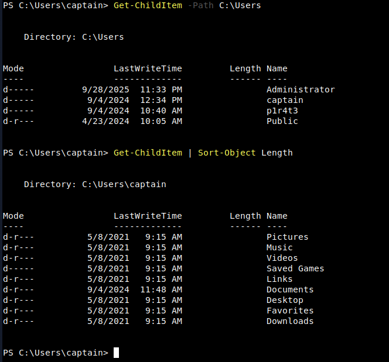 
  <em>Figure 2: Example of me using piping in PowerShell. The first command `Get-ChildItem -Path C:\Users` lists all directories under `C:\Users`. In the second command, I piped the results of `Get-ChildItem` into `Sort-Object Length` to sort the output by size, showing how PowerShell can pass objects through the pipeline for further processing.  
</em>

### Commands I Used
- `Get-ChildItem | Sort-Object Length`
- `Get-ChildItem | Where-Object -Property Extension -eq ".txt"`
- `Get-ChildItem | Where-Object -Property Name -like "ship*"`
- `Get-ChildItem | Select-Object Name, Length`
- `Select-String -Path .\captain-hat.txt -Pattern "hat"`

### Why I Used These Commands
- I used `Sort-Object` to sort the current working directory by size (`Length`). I figured thid could be good to quickly identify unusually large files.
    - For example, `Get-ChildItem | Sort-Object Length` gave me a list of file names in order of size. (Figure 2)
- `Where-Object` let me narrow down results to specific file types or names.
    - For example, `Get-ChildItem | Where-Object -Property Name -like "ship*"` helped me filter for files with names containing "ship".
    - I also practiced filtering by extension, like `Get-ChildItem | Where-Object -Property Extension -eq ".txt"` which returned only .txt files from the directory I ran it in.

 

  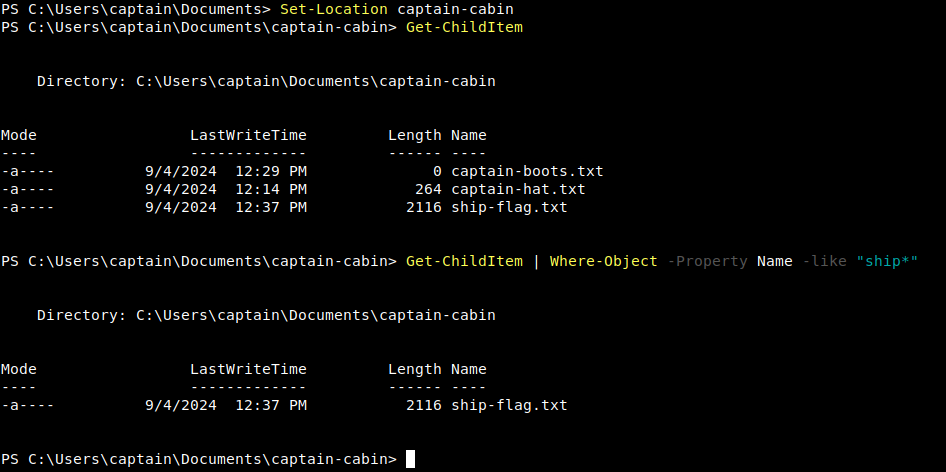 
  <em>Figure 3</em>

- `Select-Object` was useful when I only needed a subset of properties, reducing noise.
    - For example, `Get-ChildItem | Select-Object Name, Length` gave me a clean list of just file names (`Name`) and sizes (`Length`).
 
 

  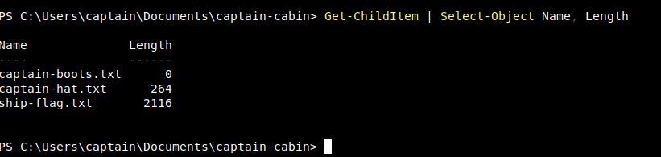 
  <em>Figure 4</em>

- I used `Select-String` to looks for text patterns inside files, similar to how `grep` works in Unix/Linux or `findstr` works in Windows CMD was chosen to replicate log searches. I figured this could be good in helping me locate strings of interest (like suspicious indicators).
    - For example, as part of the exercise, I got to run the command `Select-String -Path .\captain-hat.txt -Pattern "hat"` which searched the file `captain-hat.txt` for the text "hat". It returned the line in the file that contain the word "hat". By default, it seemed to have also showed the line number and highlighted the matched text.
 
 

  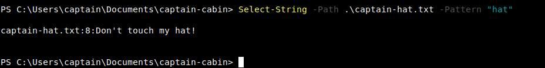 
  <em>Figure 5</em>

- I also learned about comparison operators (`-ne`, `-gt`, `-ge`, `-lt`, and `-le`) which let me filter objects based on numeric or conditional criteria, such as finding files greater than a certain size.  

#### Challenge
At the end of this section, there was a hands-on challenge that asked me to retrieve only the items in the current directory with a size greater than 100. I solved it using the following command: `Get-Children | Where-Object -Property Length -gt 100`

 

  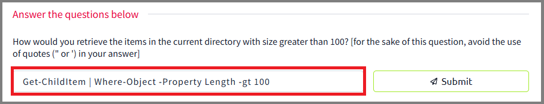 
  <em>Figure 6</em>

- `Get-ChildItem` → lists all files and directories in the current location (similar to dir in CMD or ls in Linux).
- `|` (pipe) → takes the output of Get-ChildItem and sends it into the next command for filtering.
- `Where-Object` → evaluates each item coming through the pipeline and only keeps those that meet a condition.
- `-Property Length` → specifies the property to evaluate, in this case the file size (in bytes).
- `-gt 100` → comparison operator meaning “greater than 100.” This ensures only items larger than 100 bytes are returned.

 

  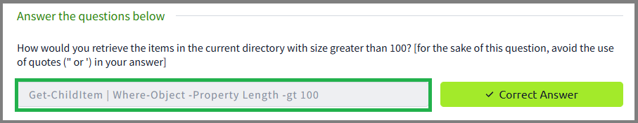 
  <em>Figure 7: Woohoo!</em>

### Why This Matters
Instead of manually checking each file, I automated the process:  
- Sorting by size lets me quickly identify unusually large or suspicious files.  
- Filtering by extension helps when hunting for specific file types (like `.log` or `.exe`).  
- `Select-String` gave me the equivalent of `grep` — powerful for scanning logs for IOCs.

### Real-World Value
In a SOC environment, I could use this same method to **parse event logs, filter by criteria, and search for suspicious strings** without needing third-party tools.

---

## Task 6: System and Network Information

### What I Did
I retrieved system information, checked for local users, and pulled detailed network configuration and IP assignments.

### Commands I Used
- `Get-ComputerInfo`
- `Get-LocalUser`
- `Get-NetIPConfiguration`
- `Get-NetIPAddress`

### Why I Used These Commands
- `Get-ComputerInfo` gave me a comprehensive baseline snapshot of the OS and hardware.  
- `Get-LocalUser` let me identify which accounts exist and which accounts are enabled on the target machine (indicated by `True` or `False` under the `Enabled` column) — key for spotting suspicious or hidden users.  
- `Get-NetIPConfiguration` provided networking info at a glance, such as IP addresses, DNS servers, and configurations.
- `Get-NetIPAddress` gave me specific IP assignment details configured on the system, useful when investigating anomalies.

### Why This Matters
These commands provided me with:  
- A complete system snapshot (`Get-ComputerInfo`).  
- A list of all local accounts, which is critical for detecting hidden or unauthorized users.  
- Networking details including DNS and gateway configuration — the same data often checked during incident response.  

#### Hidden Treasure Challenge

At the end of this section there was a hands-on challenge to find a “secret” file in the user `p1r4t3`’s home folder.

 

  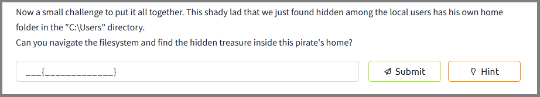 
  <em>Figure 8</em>

I started by changing directories to `C:\Users` with `Set-Location` to locate the user `p1r4te`.  

 

  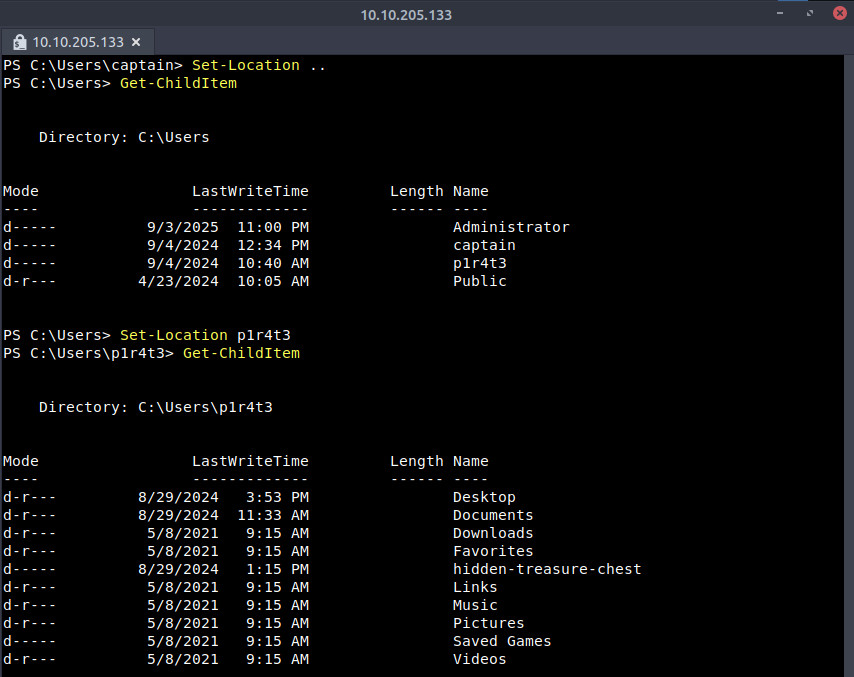 
  <em>Figure 9</em>

I listed the contents with `Get-ChildItem` and discovered a directory called `hidden-treasure-chest`. Then, I changed into that directory using `Set-Location`, ran `Get-ChildItem` again, and saw a `.txt` file named `big-treasure.txt`.

 

  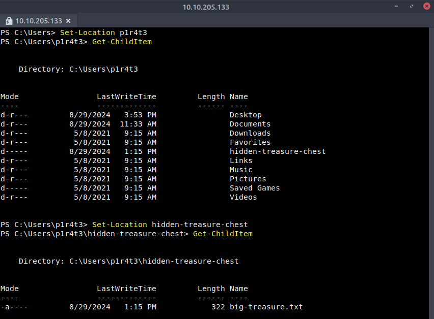 
  <em>Figure 10</em>

Finally, I opened the file with `Get-Content big-treasure.txt` and retrieved the answer to the lab challenge.

 

  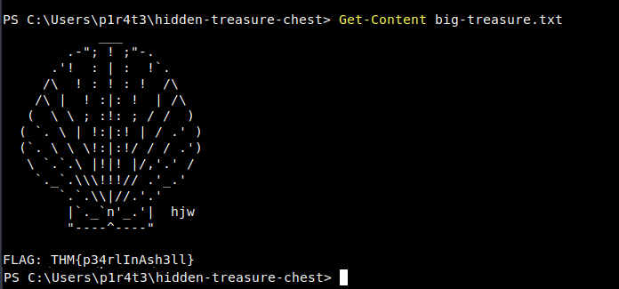 
  <em>Figure 11</em>

Woohoo!

 

  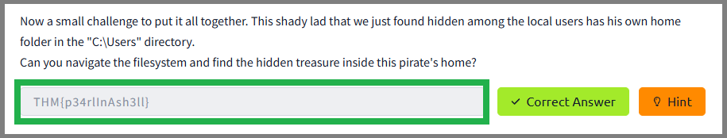 
  <em>Figure 12</em>

### Real-World Value
This aligns with **host auditing and reconnaissance**. For example, if I suspect persistence mechanisms or hidden accounts, I can use these commands to validate the system baseline.

---

## Task 7: Real-Time System Analysis

### What I Did
I moved into monitoring mode — checking processes, services, open connections, and verifying file integrity with hashes.

### Commands I Used
- `Get-Process`
- `Get-Service`
- `Get-NetTCPConnection`
- `Get-FileHash`

### Why I Used These Commands
- `Get-Process` helped me monitor active processes, which seems to be helpful in spotting unusual resource usage.  
- `Get-Service` revealed a table of services that are running, stopped, or paused. Would be helpful in indentifying if attackers had tampered with system services.  
- `Get-NetTCPConnection` displayed all current TCP connections at the time, which essentially gives insights into both local and remote endpoints. Would be essential for identifying unauthorized or suspicious outbound network connections.  
- `Get-FileHash` allowed me to verify the integrity of key files, confirming whether they had been altered.

### Why This Matters
- `Get-Process` shows CPU/memory usage — key for spotting rogue processes.  
- `Get-Service` reveals which services are running or disabled. Attackers often tamper with these.  
- `Get-NetTCPConnection` gives visibility into open network connections — crucial for uncovering backdoors or suspicious outbound traffic.  
- `Get-FileHash` verifies if a file has been altered (tampered with malware, for example).
    - I navigated into the captain-cabin directory using `Set-Location -Path captain\Documents\captain-cabin`. Once inside, I listed all files with `Get-ChildItem`, which revealed three text files:
        - `captain-boots.txt`
        - `captain-hat.txt`
        - `ship-flag.txt`
  - Since the lab required verifying the integrity of the `ship-flag.txt` file, I ran `Get-FileHash -Path .\ship-flag.txt` to generate its SHA256 hash. The command returned a unique hash value (`54D2EC3C12BF3DBA25B95EB0BEB376052295AF53A22BA8E60D444880073D48F2`) that can be used to confirm the authenticity of the file.
  - Using file hashing like this is especially valuable for real-time monitoring and analysis in security operations. By continuously checking file hashes against known-good values (or comparing them to threat intelligence databases), analysts can quickly detect tampering, malware infection, or unauthorized file changes. This makes it a practical tool for ensuring integrity and spotting potential compromise during live investigations.

#### Challenge Questions

In this part of the lab, I was presented with the following questions:

1. **In the previous task, you found a marvellous treasure carefully hidden in the target machine. What is the hash of the file that contains it?**

 

   
  <em>Figure 13</em>

  I ran the follow commands in order:
  - `Set-Location C:\Users\p1r4t3` to navigate to the target machine directory (from previous challenge).
  - `Get-ChildItem` to list files and directories.
  - `SetLocation hidden-treasure-chest` to open the directory that contained the file I required for this question
  - `Get-FileHash big-treasure.txt` to obtain the hash value of the file `big-treasure.txt`

 

  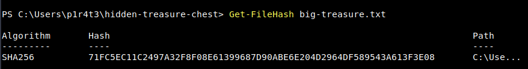 
  <em>Figure 14</em>

  First try? Woo!
   

  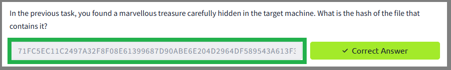 
  <em>Figure 13 (Answer)</em>

2. **What property retrieved by default by `Get-NetTCPConnection` contains information about the process that has started the connection?**

 

  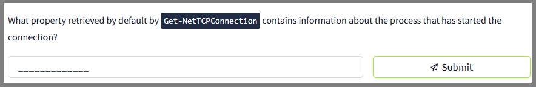 
  <em>Figure 15</em>

The question asked which property retrieved by default by `Get-NetTCPConnection` contains information about the process that has started the connection.  

From my reading and review of the cmdlet documentation, I learned that the property is **`OwningProcess`**. This property provides the Process ID (PID) of the process that owns the network connection. While the `Get-NetTCPConnection` output shows the PID, this can then be mapped back to an actual process name using the `Get-Process` cmdlet if needed.  

I did not need to discover this by running the command in the lab; instead, I was able to answer it directly from the reading material that explained how the cmdlet works and which properties it returns by default.
 
 

  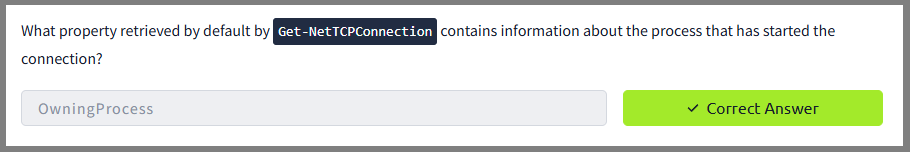 
  <em>Figure 15 (Answer)</em>

3. **It's time for another small challenge. Some vital service has been installed on this pirate ship to guarantee that the captain can always navigate safely. But something isn't working as expected, and the captain wonders why. Investigating, they find out the truth, at last: the service has been tampered with! The shady lad from before has modified the service `DisplayName` to reflect his very own motto, the same that he put in his user description.** With this information and the PowerShell knowledge built so far, the task was to **find the service name**.

 

  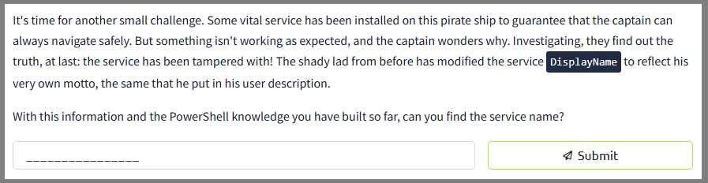 
  <em>Figure 16</em>

For this challenge, I ran the `Get-Service` cmdlet to list all services on the system. While reviewing the output, I noticed an unusual `DisplayName` that stood out from the rest:  

**"A merry life and a short one"**  

This matched the shady user’s motto from his account description. The service associated with this altered `DisplayName` was:  

**`p1r4t3-s-compass`**  

 

  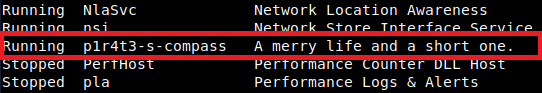 
  <em>Figure 17</em>

This confirmed that the service had been tampered with, and the correct service name was `p1r4t3-s-compass`.

 

  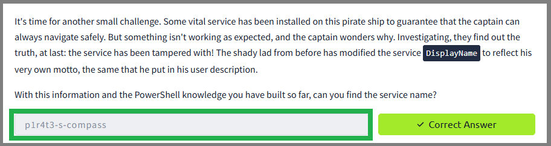 
  <em>Figure 16 (Answer)</em>

### Real-World Value

This mirrors what I’d do as an analyst during **threat hunting or incident response**, where checking processes, services, and connections is often step one.

---

## Task 8: Scripting

### What I Did
I wrapped up by practicing PowerShell scripting, focusing on how to automate repetitive tasks and even execute commands remotely with `Invoke-Command`.

### Commands I Used
- `Get-Help Invoke-Command -examples`
- `Invoke-Command -FilePath script.ps1 -ComputerName Server01`
- `Invoke-Command -ComputerName Server01 -ScriptBlock { Get-Culture }`

### Why I Used These Commands
- `Get-Help` gave me real-world examples of how to structure remote execution commands.  
- `Invoke-Command -FilePath` allowed me to run full scripts remotely, which is powerful in enterprise settings.  
- `Invoke-Command -ScriptBlock` gave me a quick way to run inline commands on remote machines without needing a script file.

### Why This Matters
- I learned how scripts can save time and reduce human error by automating repetitive tasks.  
- Remote execution is especially important: with `Invoke-Command`, I could push commands to multiple systems at once.  
- This is applicable in both defensive tasks (running IOC scans across a network) and offensive testing (enumerating systems).

### Real-World Value
This demonstrates I can **scale operations across environments**. Recruiters should see this as a practical skill: I’m not only comfortable with individual commands, but also capable of designing and running scripts to automate security workflows.

---

# Closing Notes
Across Tasks 3–8, I moved from learning the basics of PowerShell to applying it for **file management, data filtering, system analysis, and scripting automation**. These exercises show that I can use PowerShell not just as a command-line tool, but as a versatile platform for **system administration, security monitoring, and incident response**.

