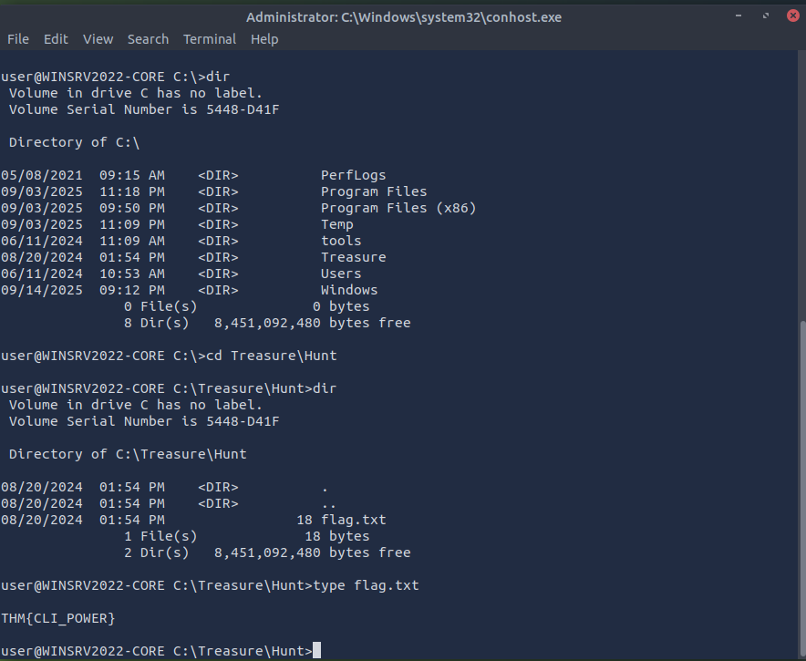
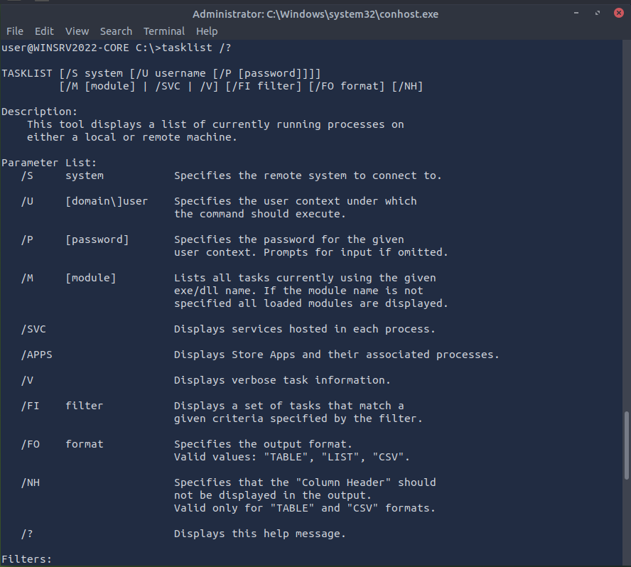
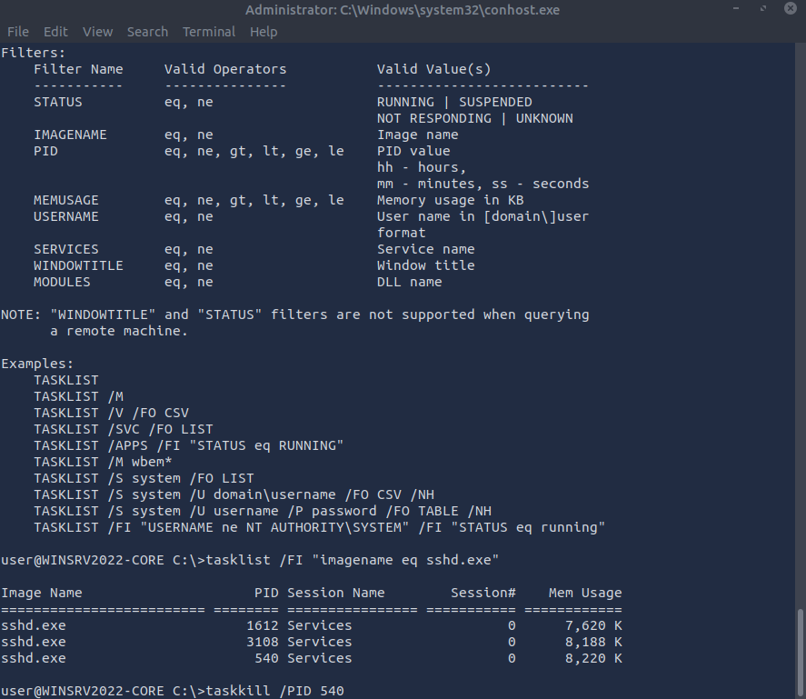
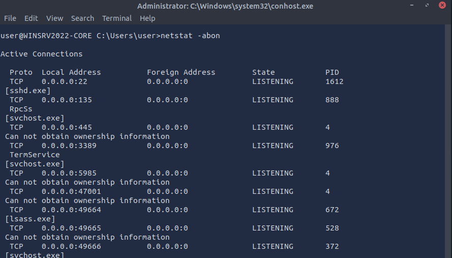
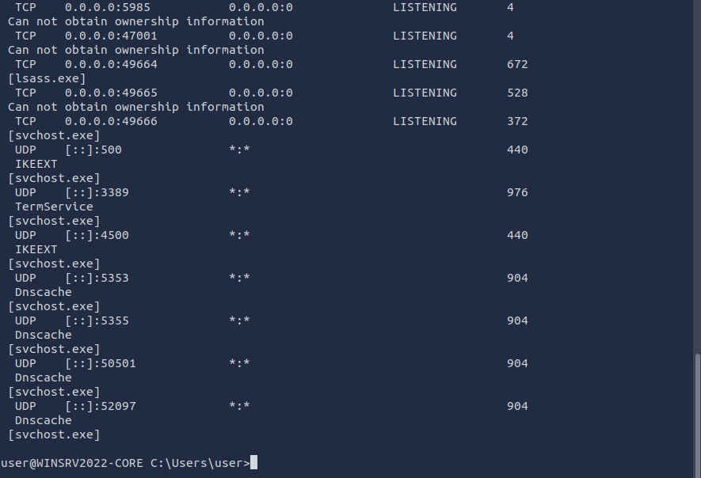

# Windows CMD Basics — File Discovery, Network & Process Investigation

## Objective
Practice core Windows CLI skills used in host triage:
- Navigate the file system and read file contents
- Enumerate running processes and identify targets
- Map **listening ports** to **process names** and **PIDs**
- Terminate a target process by PID

This lab demonstrates a realistic mini‑workflow for a SOC analyst: **discover → verify → act**.

---

## Part 1 — File Discovery and Flag Extraction
From `C:\`, I listed directories and navigated to the **Treasure\Hunt** folder, then read the flag file.

**Commands**
```
dir
cd Treasure\Hunt
dir
type flag.txt
```

**Result**
```
THM{CLI_POWER}
```

<p align="left">
  <br>
  <em>Figure 1</em>
</p>

---

## Part 2 — Process Enumeration with `tasklist`
I reviewed active processes, then filtered for **sshd.exe** to see all running instances and their PIDs.

**Commands**
```
tasklist
tasklist /FI "imagename eq sshd.exe"
```

This confirmed multiple instances of **sshd.exe** (example PIDs seen: `1612`, `3108`, `540`).  
<p align="left">
  <br>
  <em>Figure 2</em>
</p>
<p align="left">
  <br>
  <em>Figure 3</em>
</p>

---

## Part 3 — Network Enumeration with `netstat`
To correlate **open/listening ports** with **owning processes**, I used `netstat` with a consolidated set of flags:

```
netstat -abon
```

### Why `-abon`?
- **`-a`** — show **all** connections and **listening** ports  
- **`-b`** — show the **executable** (e.g., `[sshd.exe]`) that created each connection  
- **`-o`** — show the **owning PID** (lets us tie the port to a process ID)  
- **`-n`** — show addresses/ports in **numeric** form (faster, avoids DNS lookups)

> Note: On Windows, `netstat` does **not** have a `-d` switch; the common combo is `-a b o n`.  
> You can run `netstat -h` to view complete usage and available flags on your system.

**What I observed**
- `TCP 0.0.0.0:22` in **LISTENING** state, owned by **[sshd.exe]**, PID **1612**  
- Additional services listening (e.g., `RpcSs` on `135`, `TermService` on `3389`), each with their associated PID

<p align="left">
  <br>
  <em>Figure 4</em>
</p>
<p align="left">
  <br>
  <em>Figure 5</em>
</p>

This step is crucial: it **maps listeners to processes**, telling us *which* PID is bound to a suspicious or sensitive port.

---

## Part 4 — Targeted Termination with `taskkill`
After confirming the target process:
- I terminated **PID `540`** (one instance of `sshd.exe`) as part of the exercise.

**Command**
```
taskkill /PID 540
```

**Follow‑up validation**
Re‑running either of the following verifies state after the kill:
```
tasklist /FI "imagename eq sshd.exe"
netstat -abon
```
In my session, port 22 remained listening under a different PID (`1612`), which is expected if another valid service instance persists. In a real investigation, we would confirm **which** instance is malicious or unauthorized before broader remediation (e.g., stopping the service, revoking keys, or disabling startup).

---

## Key Takeaways
- `dir`, `cd`, and `type` enable quick **file discovery** and validation from the CLI.  
- `tasklist` (with filters) is ideal for **process discovery** and narrowing to a target executable.  
- `netstat -abon` is a powerful one‑liner to correlate **ports ↔ processes ↔ PIDs** without DNS noise.  
- `taskkill /PID <id>` provides precise **process termination**; always validate state after action.  
- Use `netstat -h` to review flags on the host you’re working in.

---


## Next Steps
- Expand to **PowerShell** for scripted process/port correlation and logging.  
- Add detection/containment steps as a mini **playbook** (e.g., confirm SSH configuration, review auth logs, disable/lock accounts if necessary).


## Additional Tools Awareness

In addition to the commands I demonstrated in this lab (`tasklist`, `taskkill`, `netstat`, `dir`, etc.), I am aware of several other built-in Windows utilities that could also be leveraged during endpoint triage:

- **`chkdsk`**  
  Checks the file system and disk volumes for errors and bad sectors.  
  🔎 *Scenario use:* If during investigation I suspect data corruption from malware or sudden crashes, I could run `chkdsk` to validate disk health and rule out hardware or file system integrity issues before deeper forensics.

- **`driverquery`**  
  Displays a list of installed device drivers.  
  🔎 *Scenario use:* Useful when investigating persistence or suspicious kernel-level activity. An attacker might install a rogue driver to maintain access. Running `driverquery` lets me quickly review and confirm whether only legitimate drivers are loaded.

- **`sfc /scannow`**  
  Scans system files for corruption and repairs them if possible.  
  🔎 *Scenario use:* After identifying suspicious behavior or unexpected crashes, I could use this to check for modified or corrupted system files. This helps ensure the endpoint remains stable after containment and recovery.

### Why This Matters
While these commands weren’t the focus of this lab, being aware of them strengthens my ability to perform **holistic endpoint triage**. They complement the discovery and remediation steps I practiced with `tasklist` and `netstat`, and show readiness to expand my toolkit for more advanced SOC workflows.
