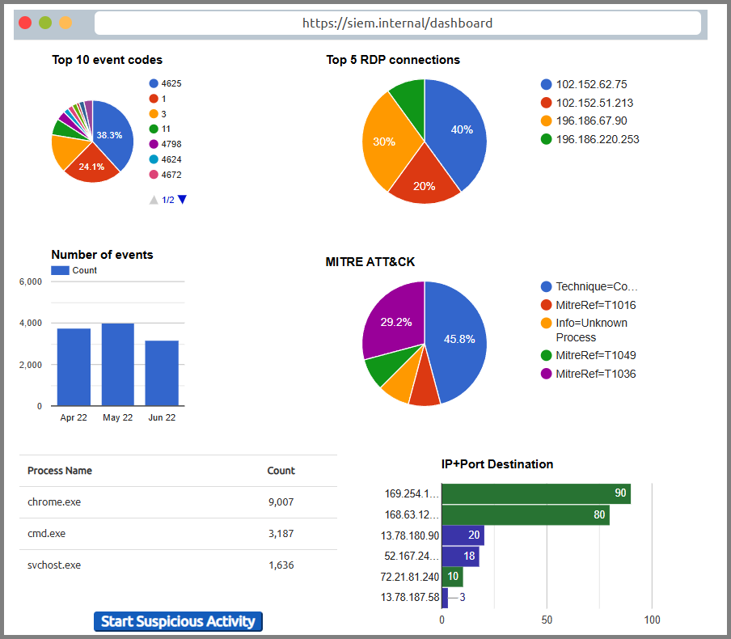

# Lab 01 – SIEM Basics: Suspicious Process Investigation

## Overview
This beginner-level lab introduced the fundamentals of working with a Security Information and Event Management (SIEM) dashboard.  
The goal was to investigate suspicious activity alerts generated within a Windows environment, focusing on processes such as `cmd.exe` and `chrome.exe`.  

By analyzing event logs, correlating alerts, and pivoting into user and host details, I practiced the workflow of a SOC analyst responding to potential threats.

The SIEM dashboard triggered an alert for suspicious `cmd.exe` execution.

   
  <em>Figure 1: Suspicious process in SIEM dashboard</em>

## Objectives
- Learn how SIEM dashboards present high-level alerts from raw event logs.
- Investigate a triggered alert and trace it back to the underlying Event ID.
- Identify the suspicious process responsible (`cmd.exe`) and differentiate it from normal processes.
- Correlate process execution with the user account and hostname involved.
- Practice triaging events to decide if further escalation would be needed.

---

## Steps Performed
1. Accessed the SIEM dashboard and reviewed an alert for **suspicious process activity**.
2. Drilled into the correlated **Windows Event ID** to see underlying log data.
3. Extracted the **process name** (`cmd.exe`) and compared it with expected behavior.
4. Identified the **user account** that launched the process.
5. Verified the **hostname** of the affected endpoint.
6. Documented findings as if preparing for escalation to Tier 2.

---

## Findings
- Process flagged: `cmd.exe`
- Associated account: `jsmith`
- Hostname: `WORKSTATION01`
- Behavior: Launch of command prompt outside of normal administrative workflow.

---

## Key Takeaways
- SIEM alerts are **starting points**, not conclusions — analysts must pivot into logs for context.  
- Understanding **Windows Event IDs** is critical for accurate triage.  
- Even “basic” investigations involve correlating multiple artifacts (process, user, host).  
- Clear documentation of each step builds an audit trail and supports escalation.  

---

## Level
**Beginner / Foundational** – This lab was designed to practice SIEM fundamentals and build confidence before progressing into advanced log correlation, custom detection rules, and threat hunting scenarios.
